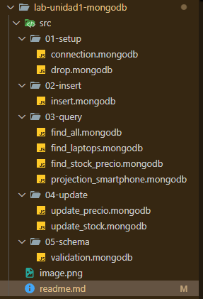
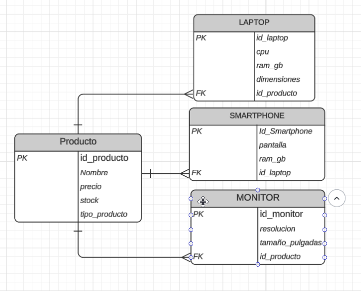
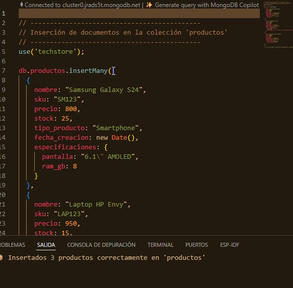
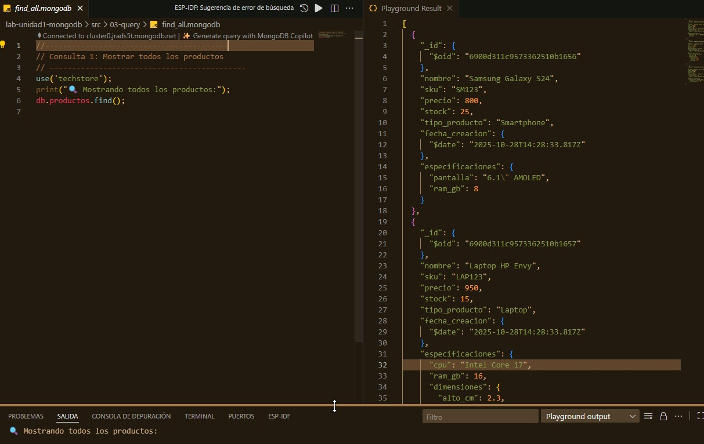
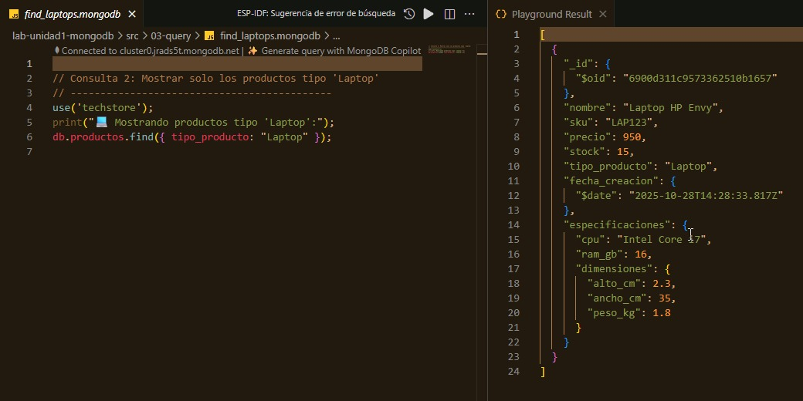
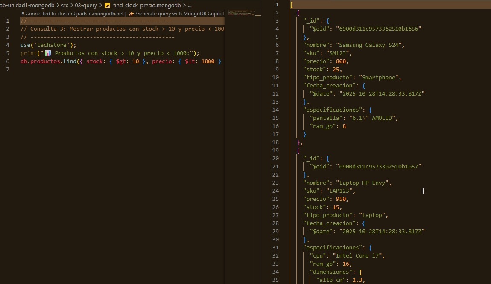
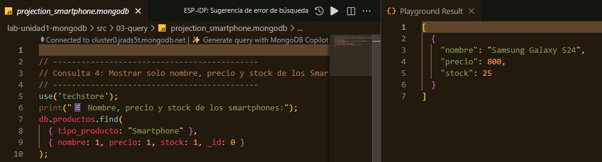
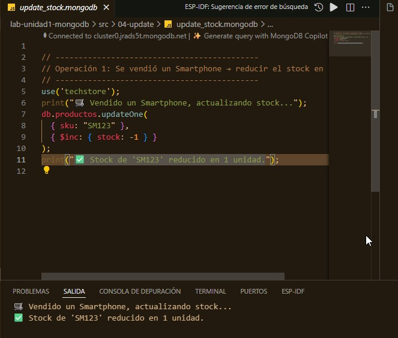
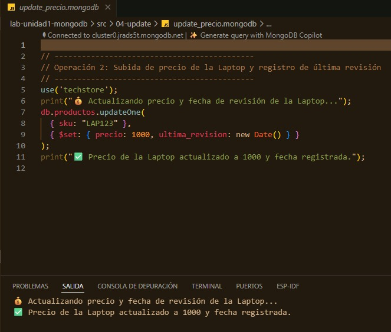

# Laboratorio Unidad 1 - MongoDB
### Nombre: Jennifer Torres
----
## Descripción
Este laboratorio tiene como objetivo aplicar los conceptos de bases de datos NoSQL utilizando **MongoDB**. Se desarrolla un caso práctico de inventario llamado **TechStore**, donde se comparan soluciones relacionales (SQL) vs NoSQL y se implementan operaciones básicas de CRUD.

---

## Contenido del Repositorio

## Diagrama Entidad Relacion 

## Análisis Comparativo SQL vs NoSQL

| Criterio | Solución Relacional (SQL) | Solución NoSQL (MongoDB) | Justificación para "TechStore" |
|-----------|----------------------------|-----------------------------|--------------------------------|
| Flexibilidad de Esquema | Rígido (requiere ALTER TABLE o tablas EAV). | Flexible (documentos JSON/BSON). | Permite añadir atributos diferentes para laptops, smartphones y monitores sin modificar la estructura. |
| Modelo de Datos | Tablas normalizadas (productos, detalles_laptop, etc.) | Colección de documentos (productos). | Un solo documento puede contener toda la información del producto, simplificando consultas. |
| Consulta de Datos | Requiere JOINs para unir tablas. | Consulta directa sobre un documento. | Evita operaciones costosas y mejora el rendimiento en consultas simples. |
| Escalabilidad | Vertical (aumentar recursos del servidor). | Horizontal (añadir más nodos fácilmente). | MongoDB permite escalar con facilidad cuando TechStore crece. |
| Mantenimiento | Complejo por dependencias entre tablas. | Simple y rápido de ajustar. | Ideal para startups o tiendas con productos variables. |

## Operaciones MongoDB
| Fase | Script                                          | Descripción                     |
| ---- | ----------------------------------------------- | ------------------------------- |
| 1    | `connection.mongodb`               | Conecta a la base               |
| 2    | `drop.mongodb`                     | Limpia la colección             |
| 3    | `insert.mongodb`                  | Inserta los 3 productos         |
| 4    | `find_all.mongodb`                 | Muestra todos los productos     |
| 5    | `find_laptops.mongodb`             | Filtra por tipo                 |
| 6    | `find_stock_precio.mongodb`        | Filtra por stock/precio         |
| 7    | `projection_smartphone.mongodb`    | Proyección de campos            |
| 8    | `update_stock.mongodb`            | Resta 1 al stock del smartphone |
| 9    | `update_precio.mongodb`           | Sube el precio de la laptop     |
| 10   | *(opcional)* `validation.mongodb` | Crea validación del esquema     |

## Documentación de Resultados
**1. Inserta los 3 productos** 

---
**2. Muestra todos los productos** 

---
**3. Filtra por tipo** 

---
**4. Filtra por stock/precio** 

---

**5. Proyección de campos** 

---
**5. Resta 1 al stock del smartphone** 

---
**6. Sube el precio de la laptop** 

--- 
### 9. Análisis Reflexivo

**1. Ventaja más significativa:**  
El modelo de documentos permite manejar productos con distintas características en una sola colección, eliminando JOINs.

**2. Anidamiento de documentos:**  
Facilita almacenar atributos únicos por tipo de producto (ej. pantalla, CPU, dimensiones) sin afectar el resto del modelo.

**3. Problemas potenciales:**  
La flexibilidad puede causar inconsistencias si no se definen reglas claras de validación o tipos de datos.

**4. Paso técnico recomendado:**  
Implementar un JSON Schema y crear índices en `sku` y `tipo_producto` para garantizar integridad y optimizar consultas.

