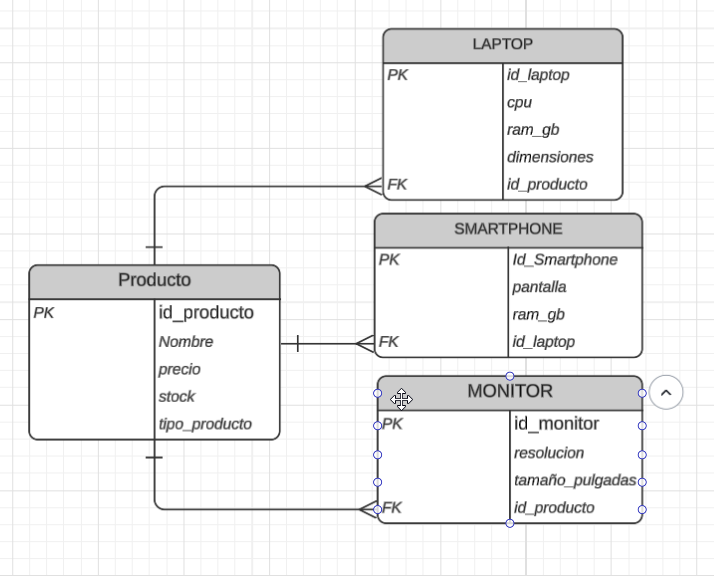

### 3. Diseño del Modelo NoSQL (MongoDB)

```json
{
  "_id": "ObjectId()",
  "nombre": "Laptop HP Envy",
  "sku": "LAP123",
  "precio": 950,
  "stock": 15,
  "tipo_producto": "Laptop",
  "fecha_creacion": "2025-10-28T00:00:00Z",
  "especificaciones": {
    "cpu": "Intel Core i7",
    "ram_gb": 16,
    "dimensiones": { "alto_cm": 2.3, "ancho_cm": 35, "peso_kg": 1.8 }
  }
}


| Criterio | Solución Relacional (SQL) | Solución NoSQL (MongoDB) | Justificación para "TechStore" |
|-----------|----------------------------|-----------------------------|--------------------------------|
| Flexibilidad de Esquema | Rígido (requiere ALTER TABLE o tablas EAV). | Flexible (documentos JSON/BSON). | Permite añadir atributos diferentes para laptops, smartphones y monitores sin modificar la estructura. |
| Modelo de Datos | Tablas normalizadas (productos, detalles_laptop, etc.) | Colección de documentos (productos). | Un solo documento puede contener toda la información del producto, simplificando consultas. |
| Consulta de Datos | Requiere JOINs para unir tablas. | Consulta directa sobre un documento. | Evita operaciones costosas y mejora el rendimiento en consultas simples. |
| Escalabilidad | Vertical (aumentar recursos del servidor). | Horizontal (añadir más nodos fácilmente). | MongoDB permite escalar con facilidad cuando TechStore crece. |
| Mantenimiento | Complejo por dependencias entre tablas. | Simple y rápido de ajustar. | Ideal para startups o tiendas con productos variables. |
